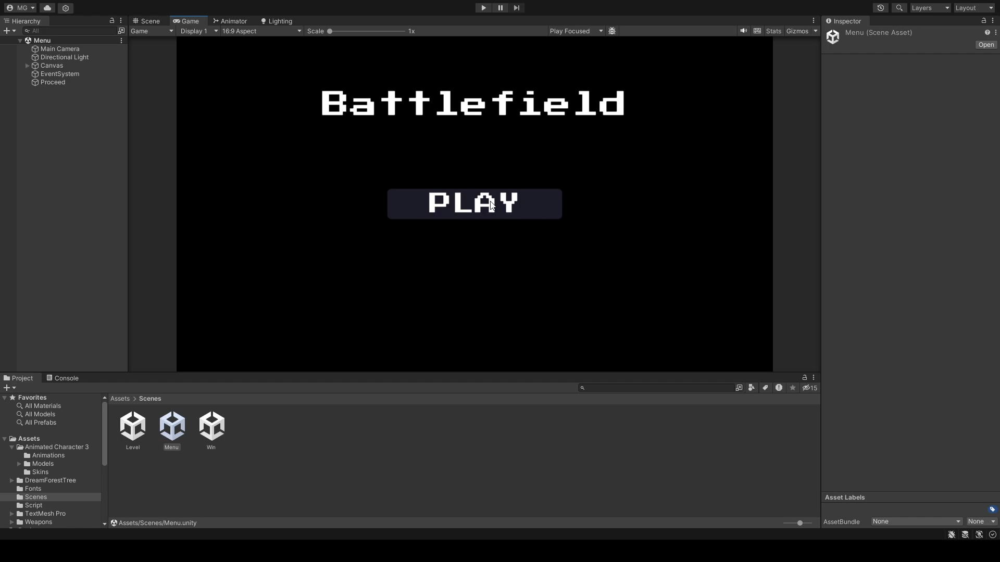

# ARVR Projects

1. Platformer
    - A small platformer concept game with an aim to reach a goal.
    - A ball possessed by the player that is supposed to dodge the obstacles and collect points.

2. Battlefield
    - A First person shooter game set in a battlefield where player has to dodge all the enemies (zombies) and shoot them.
    - Uses Unity terrain and Kenney asset packs.

3. Ball Balancing
    - A ball game scene where player has to balance a ball on a plate.
    - As the player presses different keys, they can tilt the plane in order to move the ball and avoid collision with the walls.

4. Car driving
    - A car driving game where player has to outrun a helicopter following the car.

